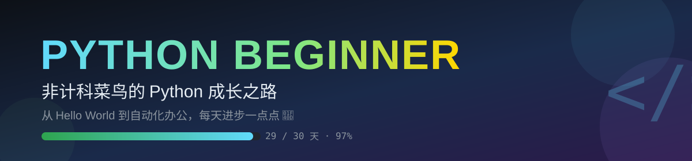

<p align="center">
  
</p>

<div align="center">


**一个非计科菜鸟的 Python 学习记录** —— 不放弃，慢慢来，每天都有新代码 ✨

</div>

---

## 📌 关于这个仓库

> 没有计算机科班背景，从零开始学 Python。
> 用「**每天一个代码文件**」的方式，把学到的知识写下来、跑起来。

- 🗓️ **Day 1 - Day 30** 学习计划，目前已完成 **29 / 30** 天
- 📝 每天对应一个 `.py` 文件 + 学习笔记
- 🔗 代码与笔记互相引用，方便回看

---

## 📊 学习进度


| 阶段 | 范围 | 内容 | 状态 |
|:---:|:---:|:---:|:---:|
| 🟦 阶段一 | Day 1 - 6 | 语法基础 | ✅ 完成 |
| 🟩 阶段二 | Day 7 - 12 | 数据结构 | ✅ 完成 |
| 🟨 阶段三 | Day 13 - 16 | 函数与进阶 | ✅ 完成 |
| 🟧 阶段四 | Day 17 - 19 | 面向对象 | ✅ 完成 |
| 🟪 阶段五 | Day 21 - 24 | 文件处理 | ✅ 完成 |
| 🟥 阶段六 | Day 25 - 29 | 第三方库实战 | ✅ 完成 |
| ⬜ 待完成 | Day 20 / 30 | 预留 | ⏳ 待更新 |

---

## 🗺️ 学习目录

### 阶段一 · Python 基础语法（Day 1 - 6）

| 天数 | 学习主题 | 代码 | 状态 |
|:---:|:---|:---|:---:|
| Day 01 | 第一个 Python 程序 | [date001.py](Day001-020/date001.py) | ✅ |
| Day 02 | 常见变量类型 | [date002.py](Day001-020/date002.py) | ✅ |
| Day 03 | 算术运算符 | [date003.py](Day001-020/date003.py) | ✅ |
| Day 04 | 分支结构 | [date004.py](Day001-020/date004.py) | ✅ |
| Day 05 | 循环结构 | [date005.py](Day001-020/date005.py) | ✅ |
| Day 06 | 100 以内的素数 | [date006.py](Day001-020/date006.py) | ✅ |

### 阶段二 · 数据结构（Day 7 - 12）

| 天数 | 学习主题 | 代码 | 状态 |
|:---:|:---|:---|:---:|
| Day 07 | 创建列表 | [date007.py](Day001-020/date007.py) | ✅ |
| Day 08 | 列表添加和删除元素 | [date008.py](Day001-020/date008.py) | ✅ |
| Day 09 | 元组的定义和运算 | [date009.py](Day001-020/date009.py) | ✅ |
| Day 10 | 字符串 | [date010.py](Day001-020/date010.py) | ✅ |
| Day 11 | 创建集合 | [date011.py](Day001-020/date011.py) | ✅ |
| Day 12 | 创建和使用字典 | [date012.py](Day001-020/date012.py) | ✅ |

### 阶段三 · 函数与进阶（Day 13 - 16）

| 天数 | 学习主题 | 代码 | 状态 |
|:---:|:---|:---|:---:|
| Day 13 | 函数和模块 | [date013.py](Day001-020/date013.py) | ✅ |
| Day 14 | 函数的应用实战 | [date014.py](Day001-020/date014.py) | ✅ |
| Day 15 | 高阶函数 | [date015.py](Day001-020/date015.py) | ✅ |
| Day 16 | 装饰器 | [date016.py](Day001-020/date016.py) | ✅ |

### 阶段四 · 面向对象（Day 17 - 19）

| 天数 | 学习主题 | 代码 | 状态 |
|:---:|:---|:---|:---:|
| Day 17 | 定义类别（类） | [date017.py](Day001-020/date017.py) | ✅ |
| Day 18 | 可见性和属性装饰器 | [date018.py](Day001-020/date018.py) | ✅ |
| Day 19 | 扑克游戏 | [date019.py](Day001-020/date019.py) | ✅ |

### 阶段五 · 文件处理（Day 21 - 24）

| 天数 | 学习主题 | 代码 | 状态 |
|:---:|:---|:---|:---:|
| Day 21 | 读写文本文件 | [date021.py](Day021-030/date021.py) | ✅ |
| Day 22 | 读写 JSON 格式数据 | [date022.py](Day021-030/date022.py) | ✅ |
| Day 23 | 读写 CSV 文件 | [date023.py](Day021-030/date023.py) | ✅ |
| Day 24 | 读写 Excel 文件 | [date024.py](Day021-030/date024.py) | ✅ |

### 阶段六 · 第三方库实战（Day 25 - 29）

| 天数 | 学习主题 | 代码 | 状态 |
|:---:|:---|:---|:---:|
| Day 25 | datetime / openpyxl 库 | [date025.py](Day021-030/date025.py) | ✅ |
| Day 26 | 操作 Word 文档（docx） | [date026.py](Day021-030/date026.py) | ✅ |
| Day 27 | 从 PDF 中提取文字 | [date027.py](Day021-030/date027.py) | ✅ |
| Day 28 | 读取和显示图像 | [date028.py](Day021-030/date028.py) | ✅ |
| Day 29 | 发送邮件和短信 | [date029.py](Day021-030/date029.py) | ✅ |

---

## 🛠️ 涉及技术栈


---

## 🚀 如何运行

```bash
# 克隆仓库
git clone https://github.com/feather222/python-beginner.git
cd python-beginner

# 直接运行某一天的代码（以第 1 天为例）
python Day001-020/date001.py
```

> 💡 **提示**：Day 26 起的代码依赖第三方库，运行前请先安装：
> `pip install openpyxl python-docx PyPDF2 pillow requests`

---

## 📎 学习笔记

- 📘 [前 20 天学习笔记](day001-020.md)
- 📗 [第 21 - 30 天学习笔记](day021-030.md)

<div align="center">

---
**坚持，是唯一的捷径。** 🐍

</div>
